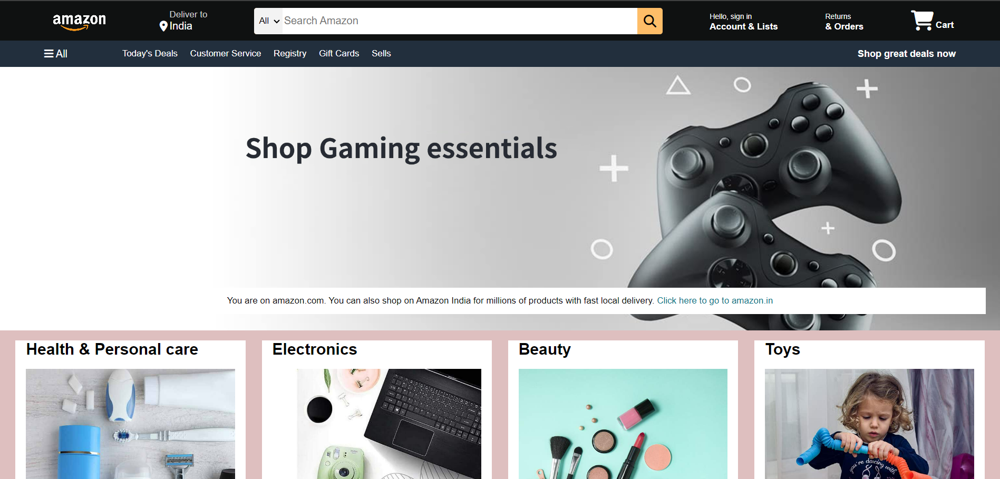

# AmazonHomePageClone
This project is a clone of the Amazon Home page, created using HTML and CSS.
It serves as a demonstration of front-end web development skills and the ability to replicate a popular e-commerce website's layout.
You can check out a live demo of the Amazon Home page clone [Amazon Home Page Clone](https://afraj2004.github.io/AmazonHomePageClone/).
## Screenshot
The screenshot of desktop view is
.
## Features

- Responsive design for various screen sizes.
- Mimics the layout and styling of the Amazon landing page.
- Placeholder product images and text for visual representation.

## Technologies Used

- HTML
- CSS

